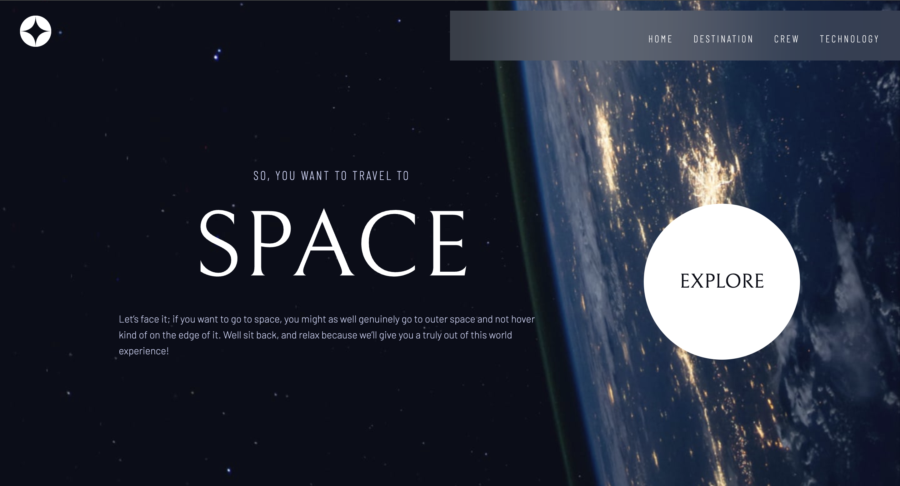
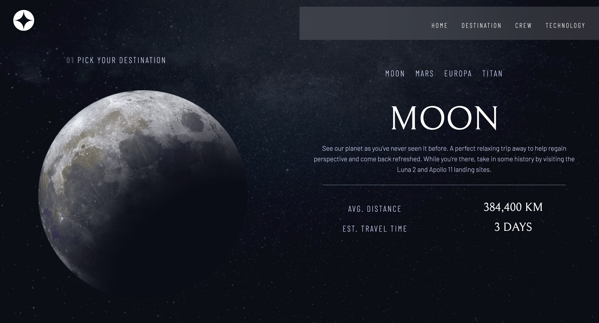
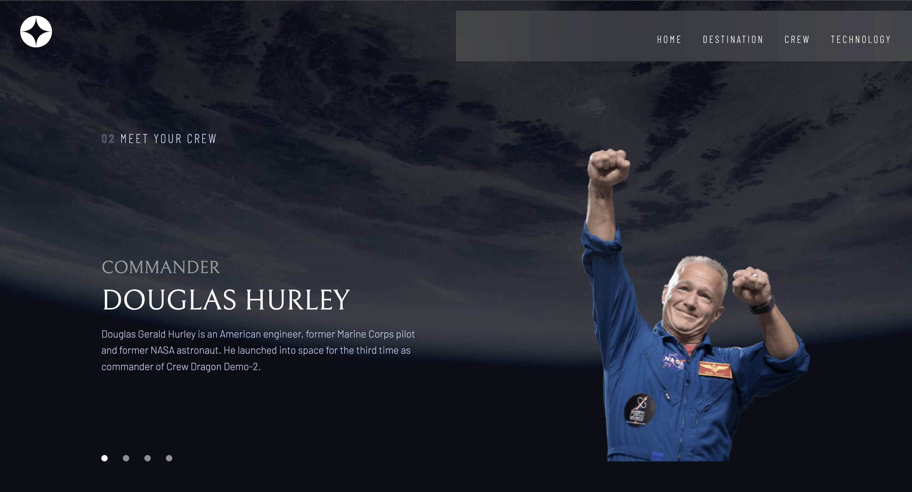
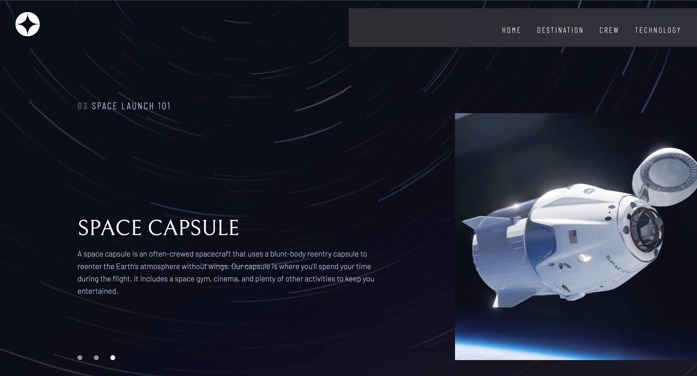
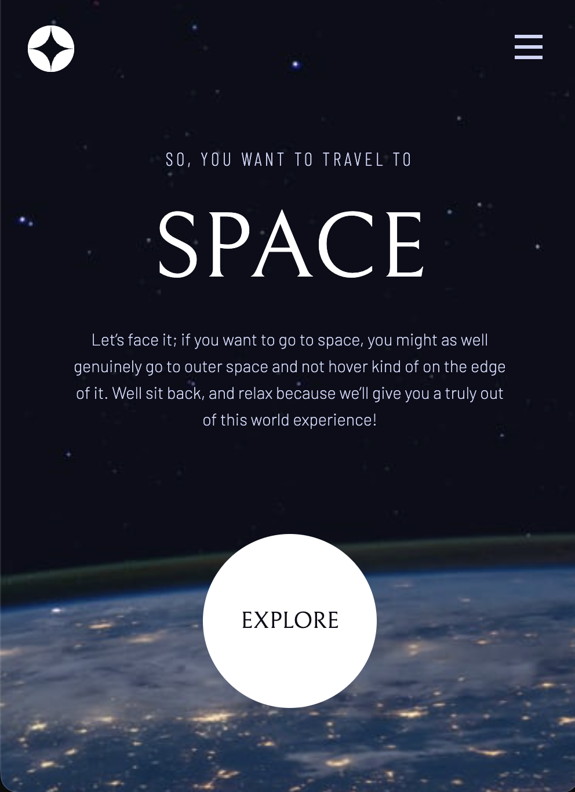
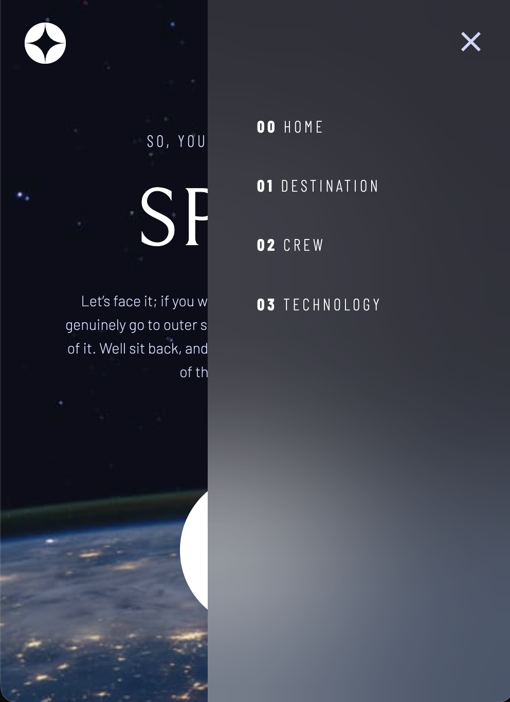
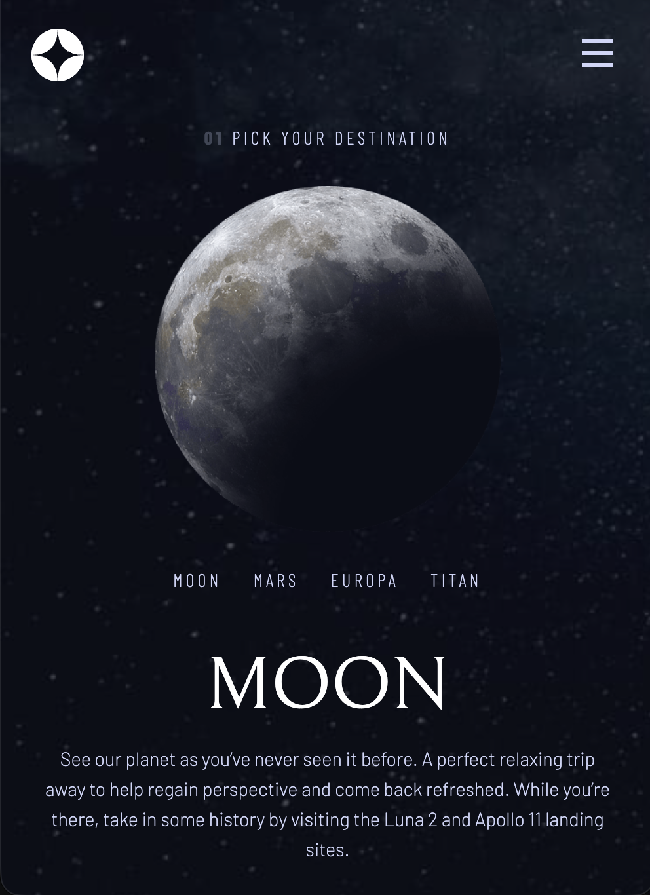
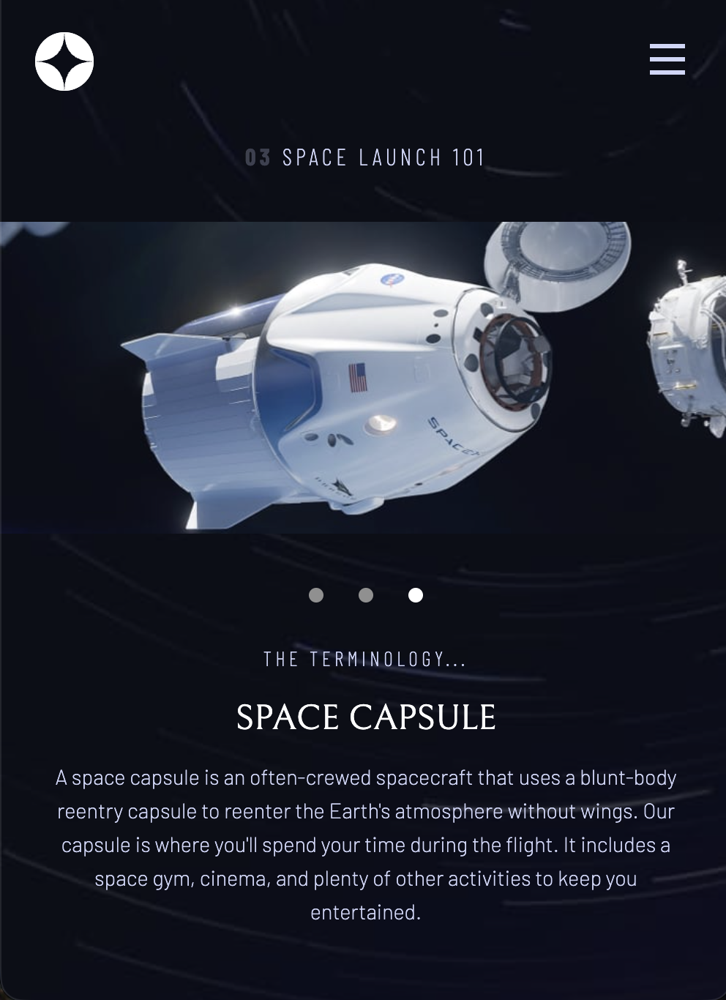

# Space Tourism

A responsive, multi-page website for a fictional space travel agency, built with **React**.

> **Status: archived.** This is my first front-end project (2025), an educational exercise that I'm keeping as a snapshot of where I started. Known limitations are listed in [Possible improvements](#possible-improvements).



## Table of contents

- [About](#about)
- [Features](#features)
- [Screenshots](#screenshots)
- [Pages](#pages)
- [Built with](#built-with)
- [Getting started](#getting-started)
- [Project structure](#project-structure)
- [Responsive design](#responsive-design)
- [What I learned](#what-i-learned)
- [Possible improvements](#possible-improvements)
- [Credits](#credits)
- [Author](#author)

## About

Space Tourism lets visitors explore destinations (Moon, Mars, Europa, Titan), meet the crew and read about the technology behind the launch. The project is a front-end implementation of the *Space tourism multi-page website* challenge from Frontend Mentor, written without any CSS framework or UI library.

## Features

- Four pages with client-side routing (no page reloads)
- Layouts for mobile, tablet and desktop, each with its own background image
- Hamburger menu on mobile; inline navigation with a blurred "glass" panel on larger screens
- Destination tabs that update the image, description, distance and travel time
- Crew and Technology sections with dot navigation
- Technology images switch between landscape and portrait depending on the viewport
- Hover states, including the halo effect on the *Explore* button

## Screenshots

### Desktop


  

  

  

### Mobile

        
  
       


## Pages

| Route   | Page        | Description                                              |
| ------- | ----------- | -------------------------------------------------------- |
| `/`     | Home        | Landing page with a call to action                       |
| `/dest` | Destination | Moon, Mars, Europa and Titan, selectable with tabs       |
| `/crew` | Crew        | Four crew members, selectable with dots                  |
| `/tech` | Technology  | Launch vehicle, Spaceport and Space capsule              |

## Built with

- [React](https://react.dev/) 18: components, props and `useState` / `useEffect`
- [React Router](https://reactrouter.com/): `createBrowserRouter` and `Link`
- [Vite](https://vite.dev/) 5: dev server and build tool
- Plain CSS: custom properties, Flexbox, CSS Grid and media queries
- [Google Fonts](https://fonts.google.com/): Bellefair, Barlow and Barlow Condensed

## Getting started

### Prerequisites

- [Node.js](https://nodejs.org/) 20 or newer, and npm

### Installation

```bash
# clone the repository
git clone https://github.com/jessmaio/spacet.git
cd spacet

# install dependencies
npm install

# start the development server
npm run dev
```

The app will be available at the address printed in the terminal (by default `http://localhost:5173`).

### Production build

```bash
npm run build     # outputs to dist/
npm run preview   # serves the production build locally
```

### Deployment note

The app uses `createBrowserRouter`, so a host must serve `index.html` for every route, otherwise refreshing a page such as `/dest` returns a 404. On Netlify, for example, add a `public/_redirects` file containing `/*    /index.html   200`. On hosts that can't do this (such as GitHub Pages), use `createHashRouter` instead.

## Project structure

```
src/
├── assets/
│   ├── img/              # backgrounds and images (home, destination, crew, technology, shared)
│   └── style/
│       ├── index.css     # reset
│       └── style.css     # project styles (variables, layout, breakpoints)
├── components/
│   ├── Menu.jsx          # logo + hamburger / inline navigation
│   ├── Home.jsx          # home page
│   ├── Dest.jsx          # destination page (tabs)
│   ├── Planet.jsx        # destination details
│   ├── Crew.jsx          # crew page (dots)
│   ├── Staff.jsx         # role / name / bio block, used by Crew and Technology
│   └── Tech.jsx          # technology page (dots)
├── App.jsx               # home route (Menu + Home)
└── main.jsx              # router setup and app entry point
```

## Responsive design

| Layout  | Viewport     | Notes                                                    |
| ------- | ------------ | -------------------------------------------------------- |
| Mobile  | < 600 px     | Hamburger menu, single column, mobile backgrounds        |
| Tablet  | 600–899 px   | Inline navigation, larger typography, tablet backgrounds |
| Desktop | ≥ 900 px     | Two-column layouts, desktop backgrounds                  |

The background image is chosen in a `useEffect` that listens to the `resize` event and sets it on `document.body`.

## What I learned

- Splitting a UI into reusable components and passing data through props
- Managing interactive state with `useState` (tabs, dots, mobile menu)
- Side effects and cleanup with `useEffect` (resize listeners)
- Multi-page navigation with React Router
- Building responsive layouts with Flexbox, CSS Grid and media queries
- Organising styles with CSS custom properties

## Possible improvements

Things I would do differently today:

- Make the tabs and dots real `<button>` elements so they work with the keyboard, and add `alt` text to all images
- Replace the `position: fixed` desktop layout of the Destination page with CSS Grid, so content can scroll on short screens
- Move the hard-coded data (planets, crew, technology) into separate JSON/JS files
- Handle responsive images with CSS or `<picture>` instead of JavaScript
- Render the menu once in a shared layout route instead of in every page
- Add a 404 page

## Credits

- Challenge, design and assets by [Frontend Mentor](https://www.frontendmentor.io). They are used here for educational purposes and remain the property of their respective owners.
- Fonts by [Google Fonts](https://fonts.google.com/).

## Author

**Jessica Maio**

